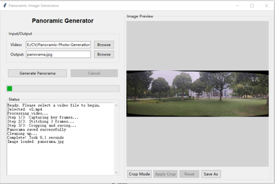
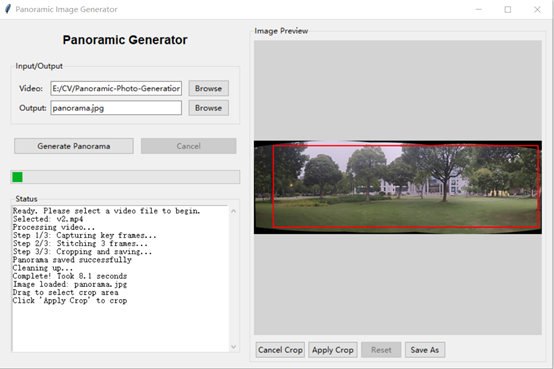
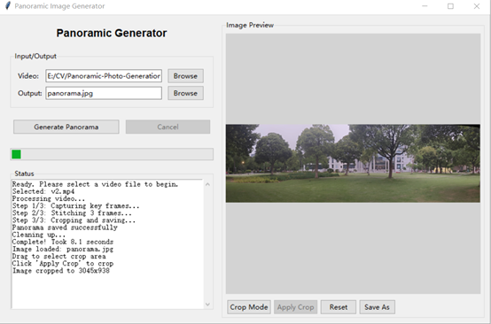

This project is the coursework (a) for the COMP3065 course, implementing the conversion from panoramic video to a panoramic image.

## System Requirements

- Python 3.x

- OpenCV (cv2)

- NumPy

- Tkinter 

- PIL (Pillow)

  

## Operation Workflow

1. **Select Input Video**: Click the "Browse" button to choose the video file to be processed.
2. **Set Output Path**: Specify the save location and filename for the resulting panoramic image.
3. **Generate Panorama**: Click the "Generate Panorama" button to start the processing.

4. **View Status**  
   Check the status area to monitor progress and messages during processing.

5. **Image Editing**  
   After processing is complete, you can further edit the image using cropping tools.
   - **Crop Mode** 
     Click the **"Crop Mode"** button to enter crop mode. You can drag to select the region to keep.  

- **Apply Crop**  

  Click the **"Apply Crop"** button to confirm the crop.
  

- **Reset Image**  
     Click the **"Reset"** button to restore the image to its original state.
- **Save As**  
   Click the **"Save As"** button to save the current image to a new location.

6. **Save Results**  
   Use the **"Save As"** button to save the edited panoramic image.

---

